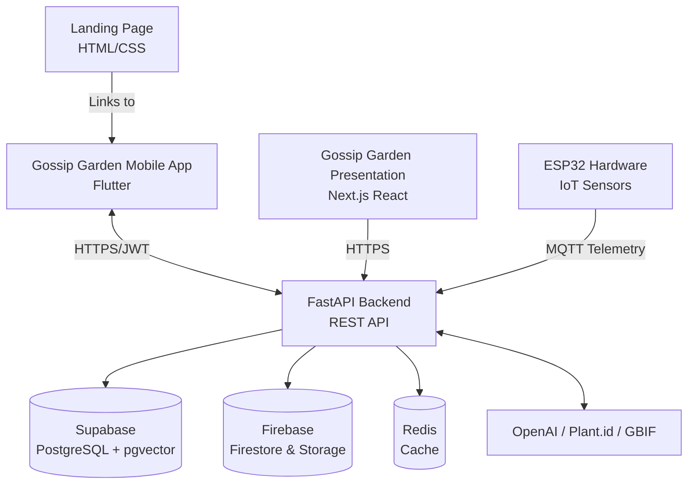
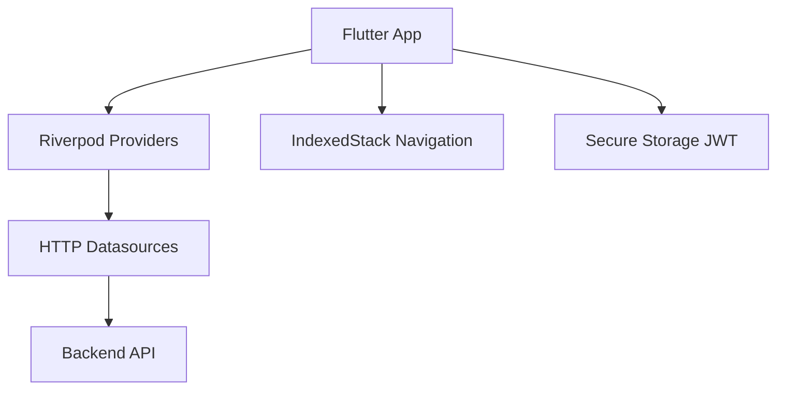
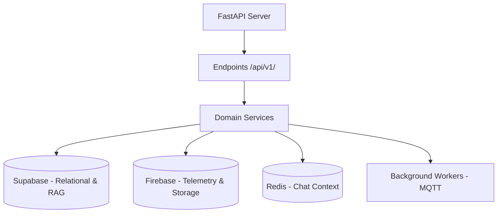
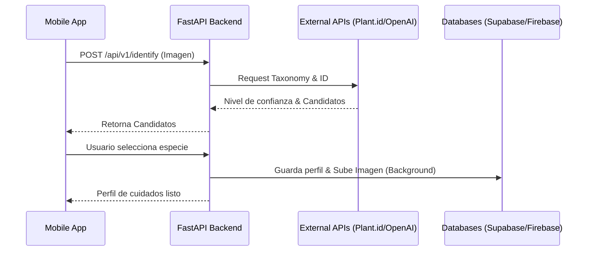

<div align="center">
  
  <h1>Gossip Garden</h1>
  <p><em>Tus plantas tienen algo que decir.</em></p>

  
  
  
  
  
  
</div>

---

## Tabla de Contenidos

1. [Visión del Ecosistema](#1-visión-del-ecosistema)
2. [Qué hace Gossip Garden](#2-qué-hace-gossip-garden)
3. [Arquitectura](#3-arquitectura)
4. [Stack Tecnológico](#4-stack-tecnológico)
5. [Estructura del Proyecto](#5-estructura-del-proyecto)
6. [Módulos Principales](#6-módulos-principales)
7. [Subsistemas](#7-subsistemas)
8. [Referencia de la API](#8-referencia-de-la-api)
9. [Sistema de Diseño](#9-sistema-de-diseño)
10. [Hardware y Entorno de QA](#10-hardware-y-entorno-de-qa)
11. [Ejecución del Sistema](#11-ejecución-del-sistema)
12. [Variables de Entorno](#12-variables-de-entorno)

---

## 1. Visión del Ecosistema

Gossip Garden es un ecosistema de IoT, Aplicación Móvil e Inteligencia Artificial que gamifica la relación del usuario con sus plantas. A través de sensores físicos, IA y un diseño UI/UX cálido, las plantas cobran vida, expresan sus necesidades mediante un chat impulsado por LLMs y reportan su estado de salud en tiempo real.



| Subsistema | Rol |
|---|---|
| **frontendGossipGarden** | Aplicación móvil en Flutter. Maneja la interfaz, seguimiento de plantas, chatbot y panel de control en tiempo real. |
| **backendGossipGarden** | API de inteligencia central. Maneja autenticación, RAG, análisis MQTT, orquestación de LLMs y lógica de bases de datos. |
| **gossip-garden-presentation** | Aplicación web en Next.js para exhibir el proyecto y las capacidades del ecosistema. |
| **LandingGossipGarden** | Página de aterrizaje estática del producto. |
| **gardwareGossipGarden** | Código C++/MicroPython para el hardware ESP32 de sensores físicos de telemetría (luz, humedad, temperatura). |

---

## 2. Qué hace Gossip Garden

| Funcionalidad | Descripción |
|---|---|
| **Identificación de Plantas con IA** | Captura una foto y obtén una coincidencia instantánea de especie, consejos de cuidado y contexto científico. |
| **Panel en Tiempo Real** | Lecturas en vivo de temperatura, humedad del suelo, humedad del aire y luz provenientes de sensores IoT. |
| **Chat Gamificado** | Conversa con tu planta a través de un LLM guiado por un prompt de personalidad específico de su especie y datos de sensores en vivo. |
| **Puntuación de Salud** | Calcula una puntuación de salud ponderada comparando datos telemétricos con el perfil óptimo de la especie. |
| **Sesiones Persistentes** | Almacenamiento seguro de JWT para evitar flujos de redirección y reutilización de contraseñas. |
| **Gestión de Fotos** | Carga y compresión automática de imágenes en segundo plano mediante Firebase Storage. |

---

## 3. Arquitectura

### Cliente

El cliente móvil está construido en Flutter utilizando Riverpod para la gestión de estado.



### Servidor

El backend actúa como el cerebro del ecosistema, orquestando múltiples servicios y una estrategia de persistencia políglota.



### Flujo de Datos



---

## 4. Stack Tecnológico

### Cliente Móvil

| Capa | Tecnología |
|---|---|
| Framework | Flutter 3 |
| Lenguaje | Dart 3 |
| Gestión de Estado | Riverpod |
| Navegación | IndexedStack (Enrutamiento basado en módulos) |
| Autenticación | Supabase JWT + Google Sign-In |
| Almacenamiento | flutter_secure_storage |

### Servidor Backend

| Capa | Tecnología |
|---|---|
| Framework | FastAPI (Python 3.11) |
| Base de Datos Primaria | Supabase (PostgreSQL + pgvector) |
| Base de Datos NoSQL | Firebase Firestore |
| Almacenamiento de Objetos | Firebase Storage |
| Caché y Sesión | Redis |
| APIs Externas | OpenAI, Plant.id, GBIF |
| Comunicación IoT | MQTT |
| Despliegue | Railway |

### Presentación y Landing

| Capa | Tecnología |
|---|---|
| Presentación | Next.js (App Router), React, Tailwind CSS v4 |
| Componentes UI | Shadcn UI, Framer Motion |
| Landing Page | HTML, CSS, Vanilla JS |

---

## 5. Estructura del Proyecto

```
GossipGarden/
├── backendGossipGarden/          # API REST FastAPI y Servicios
│   ├── app/                      # Núcleo (api, core, db, schemas, services)
│   ├── migrations/               # Migraciones de esquema PostgreSQL
│   └── API_CONTRACT.md           # Especificación de la API
├── frontendGossipGarden/         # Aplicación Móvil en Flutter
│   ├── lib/
│   │   ├── core/                 # Infraestructura compartida, configs
│   │   └── features/             # Módulos (auth, plants, chat)
│   └── CLAUDE.md                 # Guías de desarrollo
├── gossip-garden-presentation/   # Aplicación de Presentación Next.js
│   ├── app/                      # Páginas y layout (App router)
│   └── components/               # Componentes React y estilos Tailwind
├── LandingGossipGarden/          # Landing Page Estática
└── gardwareGossipGarden/         # Código IoT para ESP32
```

---

## 6. Módulos Principales

### Motor de Identificación de Plantas
Gestiona cargas multipart de imágenes, se coordina con la API de `plant.id`, cruza referencias taxonómicas con `GBIF`, consulta contexto RAG con `pgvector` y formatea la salida mediante los Structured Outputs de OpenAI.

### Motor de Chatbot LLM
Inyecta la personalidad de la planta y los datos telemétricos en vivo al prompt del sistema. Usa Redis para el historial a corto plazo del chat e implementa un servicio automático de resumen para manejar los límites de contexto, guardando logs a largo plazo en Firestore.

### Motor de Puntuación de Salud
Un algoritmo ponderado que compara la telemetría en vivo con los rangos óptimos de cuidado de la especie. Determina si la planta está saludable, en advertencia o crítica, desencadenando actualizaciones en la base de datos.

### Observador de Sesión y Autenticación
El sistema evade Firebase Auth para usar Supabase de forma nativa. Un `SessionObserver` global escucha intercepciones HTTP `401 Unauthorized` para cerrar sesión de manera segura y limpiar los estados locales.

---

## 7. Subsistemas

### Frontend (Flutter)
Prioriza el rendimiento a 60fps y una gestión de estado altamente reactiva. Omite la complejidad de un patrón Repository estricto; los Providers se conectan de forma directa a los orígenes de datos HTTP.

### Backend (FastAPI)
Emplea controladores (endpoints) delgados y servicios robustos. Usa Inyección de Dependencias de FastAPI para validar conexiones a la base de datos. Se basa en una arquitectura de datos políglota para mayor velocidad y menor costo operativo.

### Hardware (ESP32)
Microcontroladores que capturan luz, temperatura y humedad, publicando las lecturas a un bróker MQTT. El backend se suscribe a este servicio para nutrir los paneles en tiempo real.

---

## 8. Referencia de la API

Todas las rutas protegidas requieren `Authorization: Bearer <jwt>`.

### Autenticación
| Método | Ruta | Descripción |
|---|---|---|
| `POST` | `/api/v1/auth/login` | Inicio de sesión (email o Google) |

### Plantas
| Método | Ruta | Descripción |
|---|---|---|
| `GET` | `/api/v1/plants/` | Obtener todas las plantas del usuario |
| `POST` | `/api/v1/identify` | Enviar imagen para identificar especie |
| `POST` | `/api/v1/species/from-candidate` | Confirmar especie y crear perfil |
| `GET` | `/api/v1/plants/{id}/sensor-data/latest` | Obtener métricas de sensor en vivo |

### Chat
| Método | Ruta | Descripción |
|---|---|---|
| `POST` | `/api/v1/chat/{plant_id}` | Enviar mensaje a una planta |

---

## 9. Sistema de Diseño

Gossip Garden utiliza un lenguaje visual personalizado denominado **Crayon Storybook**, descartando Material Design por una estética artesanal y cálida.

- **Tipografía**: Utiliza `Quicksand` para títulos redondeados y amigables, `Nunito` para máxima legibilidad, y `Caveat` para notas dibujadas a mano.
- **Bordes y Superficies**: Fondos color crema acompañados de trazos gruesos (color tinta) para simular un dibujo a crayón.
- **Sombras**: Sombras semi-transparentes marrones, evitando colores negros o grises.
- **Texturas**: Una textura global de papel envuelve la aplicación móvil para simular la sensación de un libro físico.

---

## 10. Hardware y Entorno de QA

En la actualidad, el ecosistema opera con un único sensor físico ESP32 para fines de demostración.

**Modo de Transmisión (Single-Sensor Broadcast):**
En el entorno de QA/Demo (rama `feature/single-sensor-broadcast`), el backend intercepta la telemetría de este único sensor y la transmite simultáneamente a TODAS las plantas en la base de datos. Esto asegura que la interfaz siempre muestre métricas dinámicas para pruebas sin necesidad de desplegar granjas enteras de sensores.

---

## 11. Ejecución del Sistema

### Backend
```bash
cd backendGossipGarden
python -m venv .venv && source .venv/bin/activate
pip install -r requirements.txt
cp .env.example .env
uvicorn app.main:app --reload --port 8000
```

### Frontend
```bash
cd frontendGossipGarden/src
flutter pub get
# Ejecutar contra backend local
flutter run --dart-define=BACKEND_TARGET=local --dart-define=BACKEND_LOCAL_URL=http://127.0.0.1:8000
```

---

## 12. Variables de Entorno

**Backend (.env)**
```env
SUPABASE_URL=...
SUPABASE_KEY=...
PLANT_ID_API_KEY=...
OPENAI_API_KEY=...
MQTT_BROKER=...
REDIS_URL=...
```

**Frontend (dart-define)**
```env
BACKEND_TARGET=local|prod
BACKEND_LOCAL_URL=http://...
```
