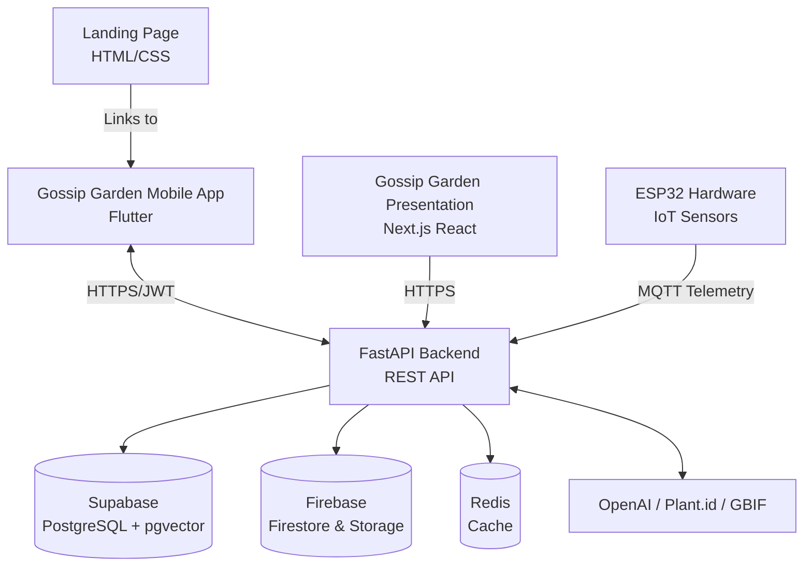
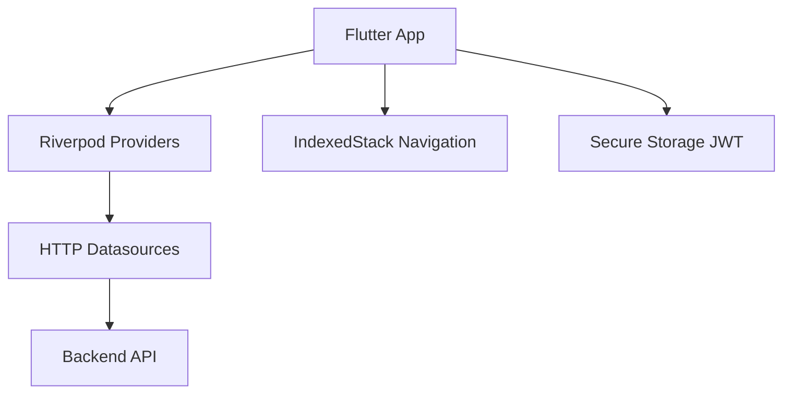
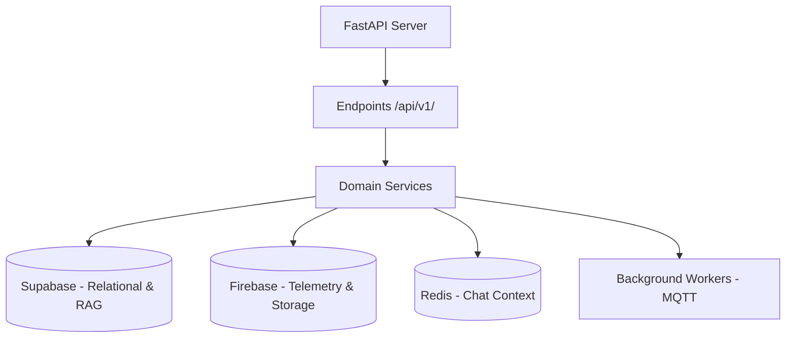
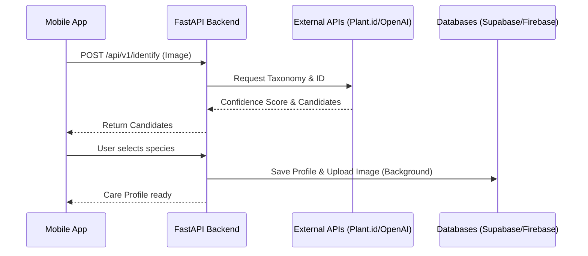

<div align="center">
  
  <h1>Gossip Garden</h1>
  <p><em>Your plants have something to say.</em></p>

  
  
  
  
  
  
</div>

---

## Table of Contents

1. [Ecosystem Overview](#1-ecosystem-overview)
2. [What Gossip Garden Does](#2-what-gossip-garden-does)
3. [Architecture](#3-architecture)
4. [Tech Stack](#4-tech-stack)
5. [Project Structure](#5-project-structure)
6. [Core Modules](#6-core-modules)
7. [Subsystems](#7-subsystems)
8. [API Reference](#8-api-reference)
9. [Design System](#9-design-system)
10. [Hardware and QA Environment](#10-hardware-and-qa-environment)
11. [Running the Ecosystem](#11-running-the-ecosystem)
12. [Environment Variables](#12-environment-variables)

---

## 1. Ecosystem Overview

Gossip Garden is an IoT, Mobile Application, and AI ecosystem that gamifies user interaction with plants. Through physical sensors, Artificial Intelligence, and a warm UI/UX design, plants come to life, express their needs via an LLM-powered chat, and report their health status in real time.



| Subsystem | Role |
|---|---|
| **frontendGossipGarden** | Mobile application in Flutter. Handles UI, plant tracking, chatbot interface, and real-time dashboards. |
| **backendGossipGarden** | Central intelligence API. Handles auth, RAG, MQTT parsing, LLM orchestration, and database logic. |
| **gossip-garden-presentation** | Next.js web application for showcasing the project and ecosystem capabilities. |
| **LandingGossipGarden** | Static landing page for the product. |
| **gardwareGossipGarden** | ESP32 C++/MicroPython codebase for the physical telemetry sensors (light, humidity, temp). |

---

## 2. What Gossip Garden Does

| Feature | Description |
|---|---|
| **AI Plant Identification** | Capture a photo and get an instant species match, care tips, and scientific context. |
| **Real-time Dashboard** | Live temperature, soil humidity, air humidity, and light readings from IoT sensors. |
| **Gamified Plant Chat** | Converse with your plant via an LLM driven by a species-specific personality prompt and live sensor data. |
| **Health Scoring** | Calculates a weighted health score comparing real-time sensor data with the species' optimal care profile. |
| **Persistent Sessions** | Secure JWT storage preventing browser redirect loops and password reuse. |
| **Photo Management** | Automatic background uploading and compression of plant images via Firebase Storage. |

---

## 3. Architecture

### Client

The mobile client is built on Flutter using Riverpod for state management.



### Server

The backend acts as the brain of the ecosystem, orchestrating multiple services and a polyglot persistence strategy.



### Data Flow



---

## 4. Tech Stack

### Mobile Client

| Layer | Technology |
|---|---|
| Framework | Flutter 3 |
| Language | Dart 3 |
| State Management | Riverpod |
| Navigation | IndexedStack (Custom feature-based routing) |
| Authentication | Supabase JWT + Google Sign-In |
| Storage | flutter_secure_storage |

### Backend Server

| Layer | Technology |
|---|---|
| Framework | FastAPI (Python 3.11) |
| Database Primary | Supabase (PostgreSQL + pgvector) |
| Database NoSQL | Firebase Firestore |
| Object Storage | Firebase Storage |
| Cache & Session | Redis |
| External APIs | OpenAI, Plant.id, GBIF |
| IoT Communication| MQTT |
| Deployment | Railway |

### Presentation & Landing

| Layer | Technology |
|---|---|
| Presentation | Next.js (App Router), React, Tailwind CSS v4 |
| UI Components | Shadcn UI, Framer Motion |
| Landing Page | HTML, CSS, Vanilla JS |

---

## 5. Project Structure

```
GossipGarden/
├── backendGossipGarden/          # FastAPI REST API and Services
│   ├── app/                      # Application core (api, core, db, schemas, services)
│   ├── migrations/               # PostgreSQL schema migrations
│   └── API_CONTRACT.md           # API specification
├── frontendGossipGarden/         # Flutter Mobile Application
│   ├── lib/
│   │   ├── core/                 # Shared infrastructure, config, observers
│   │   └── features/             # Feature modules (auth, plants, chat)
│   └── CLAUDE.md                 # Developer guidelines
├── gossip-garden-presentation/   # Next.js Presentation App
│   ├── app/                      # App router layout and pages
│   └── components/               # React components and Tailwind styles
├── LandingGossipGarden/          # Static Web Landing
└── gardwareGossipGarden/         # ESP32 IoT Codebase
```

---

## 6. Core Modules

### Plant Identification Engine
Handles multipart image uploads, coordinates with the `plant.id` API, cross-references with `GBIF` for taxonomy, queries `pgvector` for RAG context, and formats the output using OpenAI Structured Outputs.

### LLM Chatbot Engine
Injects the plant's personality and real-time sensor data into the system prompt. Uses Redis for short-term chat history and implements an automatic summarization service to handle context window limits, persisting long-term logs in Firestore.

### Health Scoring Engine
A weighted algorithm that compares live telemetry against a species' optimal comfort ranges. Determines if the plant is healthy, warning, or critical, triggering status updates in the database.

### Auth & Session Observer
Bypasses Firebase Auth to use Supabase natively. The frontend stores tokens securely. A global `SessionObserver` listens for `401 Unauthorized` responses to gracefully log users out and clear states.

---

## 7. Subsystems

### Frontend (Flutter)
Focuses on 60fps performance and highly reactive state management. Does not strictly adhere to the Repository pattern to reduce boilerplate; Providers connect directly to HTTP Datasources.

### Backend (FastAPI)
Employs thin endpoints and fat services. Uses Dependency Injection for database and authentication instances. Integrates a polyglot data architecture to optimize cost and speed.

### Hardware (ESP32)
Microcontrollers gather light, temperature, and humidity metrics, publishing them to an MQTT broker. The backend subscribes to this broker to feed the real-time dashboards.

---

## 8. API Reference

All protected routes require `Authorization: Bearer <jwt>`.

### Authentication
| Method | Route | Description |
|---|---|---|
| `POST` | `/api/v1/auth/login` | Login via email/password or Google ID token |

### Plants
| Method | Route | Description |
|---|---|---|
| `GET` | `/api/v1/plants/` | Get all user plants |
| `POST` | `/api/v1/identify` | Send image for species identification |
| `POST` | `/api/v1/species/from-candidate` | Confirm species and generate care profile |
| `GET` | `/api/v1/plants/{id}/sensor-data/latest` | Get real-time sensor metrics |

### Chat
| Method | Route | Description |
|---|---|---|
| `POST` | `/api/v1/chat/{plant_id}` | Send message to a plant |

---

## 9. Design System

Gossip Garden utilizes a custom visual language dubbed **Crayon Storybook**, eschewing standard Material Design for a handcrafted, warm aesthetic.

- **Typography**: Uses `Quicksand` for rounded, friendly titles, `Nunito` for high legibility, and `Caveat` for handwritten notes.
- **Borders and Surfaces**: Cream backgrounds paired with thick, ink-colored borders to simulate a marker or crayon drawing.
- **Shadows**: Semi-transparent brown shadows, avoiding pure blacks or grays.
- **Textures**: A global paper texture overlay runs across the application to simulate a physical book feel.

---

## 10. Hardware and QA Environment

Currently, the ecosystem operates with a single physical ESP32 sensor for demonstration purposes. 

**Single-Sensor Broadcast Mode:**
In the QA/Demo environment (branch `feature/single-sensor-broadcast`), the backend intercepts the single sensor's telemetry and broadcasts it to ALL plants in the database simultaneously. This ensures the dashboard always displays live data for demonstration without needing multiple physical sensors.

---

## 11. Running the Ecosystem

### Backend
```bash
cd backendGossipGarden
python -m venv .venv && source .venv/bin/activate
pip install -r requirements.txt
cp .env.example .env
uvicorn app.main:app --reload --port 8000
```

### Frontend
```bash
cd frontendGossipGarden/src
flutter pub get
# Run against local backend
flutter run --dart-define=BACKEND_TARGET=local --dart-define=BACKEND_LOCAL_URL=http://127.0.0.1:8000
```

---

## 12. Environment Variables

**Backend (.env)**
```env
SUPABASE_URL=...
SUPABASE_KEY=...
PLANT_ID_API_KEY=...
OPENAI_API_KEY=...
MQTT_BROKER=...
REDIS_URL=...
```

**Frontend (dart-define)**
```env
BACKEND_TARGET=local|prod
BACKEND_LOCAL_URL=http://...
```
