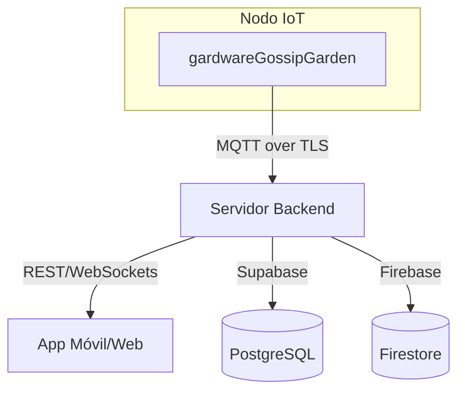
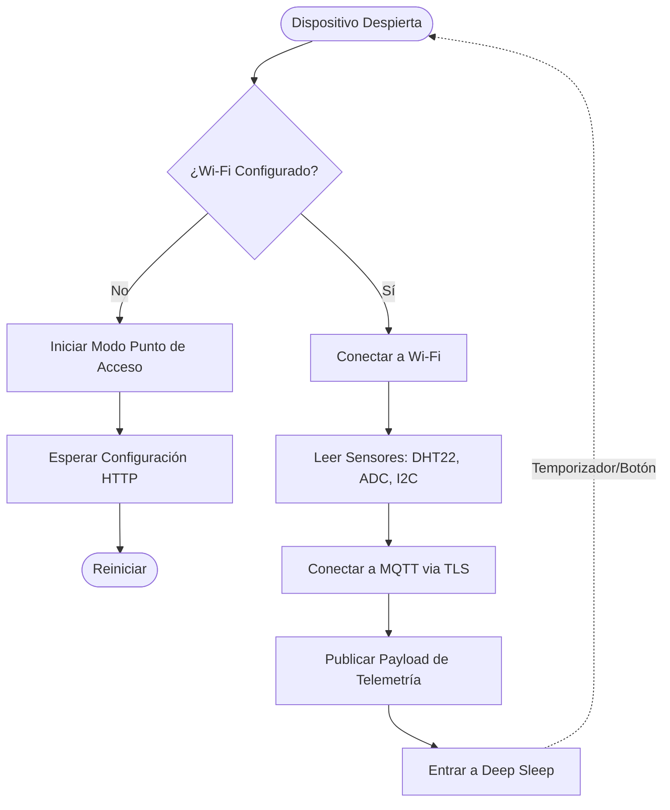
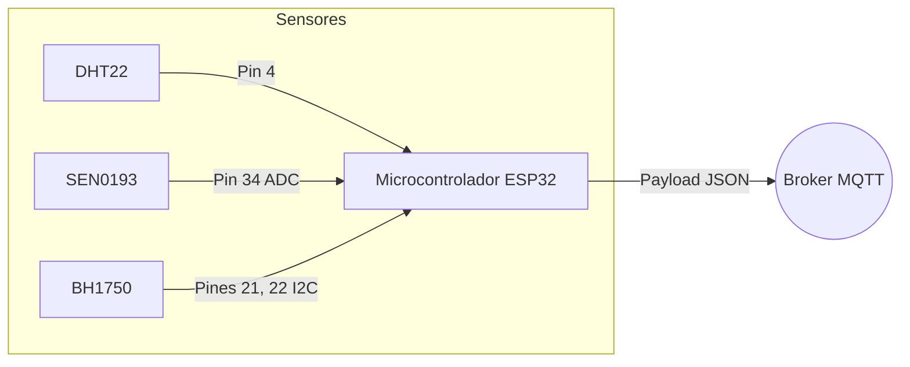

<div align="center">
  
  <h1>Gardware Gossip Garden</h1>
  <p>El módulo de hardware central del ecosistema Gossip Garden — una aplicación en MicroPython basada en ESP32 que unifica telemetría en tiempo real de sensores ambientales, comunicación MQTT segura y gestión inteligente de energía en un nodo IoT perfecto.</p>

  
  
  
</div>

---

## Tabla de Contenidos

1. [Visión General del Ecosistema](#1-visión-general-del-ecosistema)
2. [Qué hace Gardware Gossip Garden](#2-qué-hace-gardware-gossip-garden)
3. [Arquitectura](#3-arquitectura)
4. [Stack Tecnológico](#4-stack-tecnológico)
5. [Estructura del Proyecto](#5-estructura-del-proyecto)
6. [Módulos Principales](#6-módulos-principales)
7. [Servidor Web Integrado](#7-servidor-web-integrado)
8. [Referencia de API](#8-referencia-de-api)
9. [Ensamblaje de Hardware](#9-ensamblaje-de-hardware)
10. [Flashing y Ejecución](#10-flashing-y-ejecución)
11. [Detalles de Configuración](#11-detalles-de-configuración)
12. [Gestión de Energía](#12-gestión-de-energía)

---

## 1. Visión General del Ecosistema

Gossip Garden es un ecosistema inteligente de cuidado de plantas compuesto por productos interconectados que rastrean y gestionan la salud de las plantas reales:



| Producto | Rol |
|---|---|
| **gardwareGossipGarden** | (Este repositorio) El nodo físico ESP32 que recopila datos de temperatura, humedad, humedad del suelo y luz. |
| **Servidor Backend** | Consume telemetría MQTT, evalúa las puntuaciones de salud de las plantas y almacena datos en Supabase/Firebase. |
| **App Móvil** | Interfaz de usuario para monitorear la salud de las plantas, ver historial de sensores y configurar Wi-Fi. |

### Cómo se conectan los productos

1. El dispositivo arranca, lee datos de sus sensores físicos (DHT22, SEN0193, BH1750) y se conecta a la red Wi-Fi configurada.
2. El ESP32 se conecta de forma segura al broker MQTT central a través de TLS y publica un payload JSON con las lecturas de los sensores.
3. El backend recibe el mensaje MQTT, analiza la telemetría, actualiza las métricas de salud de la planta asociada y almacena el historial.
4. El dispositivo se desconecta de la Wi-Fi y entra en Deep Sleep (sueño profundo) para conservar batería hasta el próximo ciclo de lectura.

---

## 2. Qué hace Gardware Gossip Garden

| Característica | Descripción |
|---|---|
| **Telemetría Ambiental** | Recopila datos precisos de temperatura y humedad mediante un sensor DHT22. |
| **Detección de Humedad del Suelo** | Utiliza un sensor capacitivo analógico (SEN0193) para determinar el nivel de agua, evitando problemas de corrosión de los sensores resistivos. |
| **Sensor de Luz Ambiental** | Mide la iluminancia en lux usando un sensor digital I2C BH1750 para garantizar que la planta reciba luz óptima. |
| **Publicación MQTT Segura** | Envía datos de forma segura a un broker en la nube vía TLS en el puerto 8883, autenticándose con usuario y contraseña. |
| **Aprovisionamiento Wi-Fi Inteligente** | Cambia a modo Punto de Acceso (AP) si no hay red conocida disponible, proporcionando un servidor HTTP integrado para la configuración de red. |
| **Deep Sleep y Bajo Consumo** | Ejecuta un ciclo breve de medición y transmisión, luego apaga las radios y duerme para extender dramáticamente la vida de la batería. |
| **Despertar por Hardware** | Permite anulación manual y despertar instantáneo manteniendo presionado el botón BOOT físico durante el arranque. |

---

## 3. Arquitectura

### Flujo del Sistema



### Flujo de Datos



---

## 4. Stack Tecnológico

### Microcontrolador

| Capa | Tecnología |
|---|---|
| Hardware | Placa de Desarrollo ESP32 |
| Firmware | MicroPython |
| Red | `network.WLAN` |
| Deep Sleep | `machine.deepsleep`, `esp32.wake_on_ext0` |

### Módulos y Sensores Clave

| Componente | Propósito | Protocolo |
|---|---|---|
| **DHT22** | Temperatura y Humedad del Aire | 1-Wire (Digital) |
| **SEN0193** | Humedad Capacitiva del Suelo | ADC (Analógico) |
| **GY-30 (BH1750)** | Intensidad de Luz (Lux) | I2C |
| **umqtt.simple** | Implementación Cliente MQTT | TCP/TLS |
| **ujson** | Formateo del Payload | JSON |

---

## 5. Estructura del Proyecto

```text
gardwareGossipGarden/
│
├── main.py                   # Bucle de ejecución principal, lectura de sensores, publicación MQTT
├── wifi_manager.py           # Lógica de conexión Wi-Fi, modo AP, servidor HTTP de configuración
├── api_contract.md           # Documentación de las interfaces MQTT y HTTP
└── wifi_config.json          # (Generado) Almacena SSID y contraseña de Wi-Fi
```

---

## 6. Módulos Principales

### main.py

El punto de entrada del sistema. Maneja:
- Definición de pines e inicialización de hardware (I2C, ADC, DHT).
- Funciones de lectura de sensores con respaldos seguros y validación de datos (clamping).
- Inicialización Wi-Fi llamando a `wifi_manager`.
- Conexión al broker MQTT utilizando `ssl.SSLContext` para TLS.
- Construcción y publicación del payload JSON de telemetría.
- Entrada en deep sleep utilizando `machine.deepsleep()`.

### wifi_manager.py

Maneja el ciclo de vida de la red:
- Intenta cargar credenciales desde `wifi_config.json`.
- Intenta conectarse a la red guardada.
- Si falla (o si se fuerza), inicia un AP llamado `GossipGarden_Setup`.
- Ejecuta un servidor socket TCP no bloqueante para aceptar peticiones HTTP en el puerto 80.
- Proporciona endpoints para escanear redes, verificar estado y guardar nuevas credenciales.

---

## 7. Servidor Web Integrado

Cuando el dispositivo no puede conectarse a una red Wi-Fi conocida, aloja un servidor HTTP local en `http://192.168.4.1`. 

### Decisiones de diseño clave

| Decisión | Razón |
|---|---|
| **Servidor No Bloqueante** | Implementado usando `socket` estándar con un timeout, permitiendo que el ESP32 finalmente salga del modo AP si queda inactivo, ahorrando batería. |
| **Respuestas JSON** | Todos los endpoints devuelven JSON puro, haciéndolo fácilmente consumible por una app móvil o un asistente de configuración frontend. |
| **Enrutamiento Manual** | El análisis manual de encabezados HTTP permite un servidor ligero sin dependencias de frameworks externos. |

---

## 8. Referencia de API

### Publicación MQTT (Telemetría)

El dispositivo actúa como publicador. No se suscribe a comandos.

| Topic | Formato de Payload | Descripción |
|---|---|---|
| `plantas/{DEVICE_ID}/sensores` | JSON | Emitido después de despertar y leer los sensores. |

**Ejemplo de Payload:**

```json
{
  "plant_id": "YOUR_PLANT_ID",
  "mac_address": "24:6f:28:aa:bb:cc",
  "temperature_c": 24.5,
  "humidity_pct": 45,
  "soil_moisture_pct": 60,
  "light_lux": 350.5
}
```

### Endpoints HTTP de Configuración (Modo AP)

| Método | Ruta | Descripción |
|---|---|---|
| `GET` | `/system/info` | Devuelve la dirección MAC y versión del firmware. |
| `GET` | `/wifi/networks` | Escanea y lista las redes Wi-Fi disponibles. |
| `GET` | `/wifi/status` | Estado de la conexión actual e IP. |
| `POST` | `/wifi/connect` | Se conecta a un nuevo SSID y guarda las credenciales. |
| `POST` | `/wifi/reset` | Elimina las credenciales almacenadas. |

---

## 9. Ensamblaje de Hardware

### Mapeo de Pines

| Sensor | Pin ESP32 | Interfaz |
|---|---|---|
| Datos DHT22 | GPIO 4 | Entrada Digital |
| Datos SEN0193 | GPIO 34 | ADC (Entrada Analógica) |
| BH1750 SDA | GPIO 21 | I2C |
| BH1750 SCL | GPIO 22 | I2C |
| Botón Setup | GPIO 0 | Entrada Digital (Pull-up) |

---

## 10. Flashing y Ejecución

### Prerrequisitos

- `esptool.py` (para flashear MicroPython)
- `ampy` o `mpremote` (para subir archivos)
- Firmware MicroPython para ESP32

### Pasos

1. Flashea el ESP32 con el firmware MicroPython usando `esptool.py`.
2. Edita `main.py` para insertar tu `DEVICE_ID`, `PLANT_ID` y credenciales MQTT.
3. Sube `main.py` y `wifi_manager.py` a la placa:
   ```bash
   mpremote fs cp main.py :
   mpremote fs cp wifi_manager.py :
   ```
4. Reinicia la placa.

---

## 11. Detalles de Configuración

Las siguientes variables en `main.py` deben configurarse antes de la implementación:

| Variable | Uso |
|---|---|
| `DEVICE_ID` | Identificador único para el hardware. |
| `PLANT_ID` | UUID que vincula el hardware a una planta específica en el backend. |
| `MQTT_BROKER` | Dirección de tu clúster MQTT con TLS. |
| `MQTT_USER` / `PASSWORD` | Credenciales de autenticación para el broker. |
| `SOIL_RAW_DRY` / `WET` | Umbrales de calibración ADC para el sensor SEN0193. |

---

## 12. Gestión de Energía

El módulo utiliza la funcionalidad Deep Sleep del ESP32 para minimizar el consumo de energía. 

- **Ciclo:** El dispositivo despierta, lee los sensores, transmite los datos e inmediatamente vuelve a dormir.
- **Duración:** Definida por `SLEEP_INTERVAL_MS` (por defecto: 30 minutos).
- **Jitter:** Se añade un pequeño retardo aleatorio al tiempo de sueño para evitar colisiones de red si múltiples dispositivos se reinician simultáneamente.
- **Despertar Manual:** Presionar el botón BOOT físico (GPIO 0) puede despertar instantáneamente al dispositivo del deep sleep (`esp32.wake_on_ext0`). Mantenerlo presionado fuerza el modo AP de configuración.
