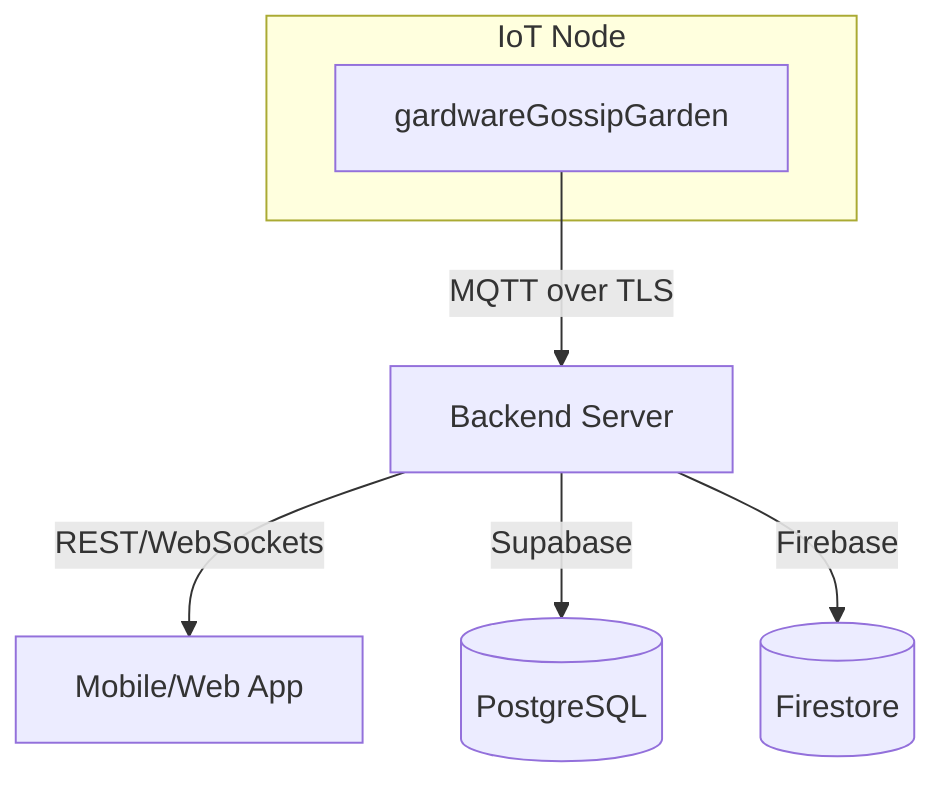
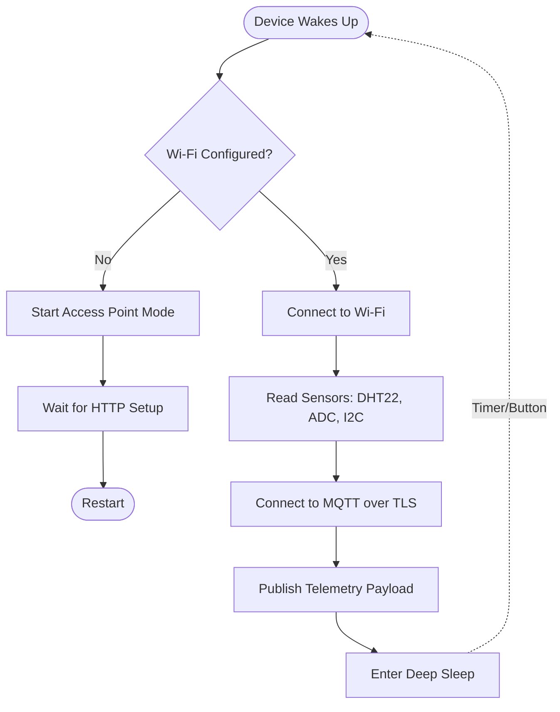
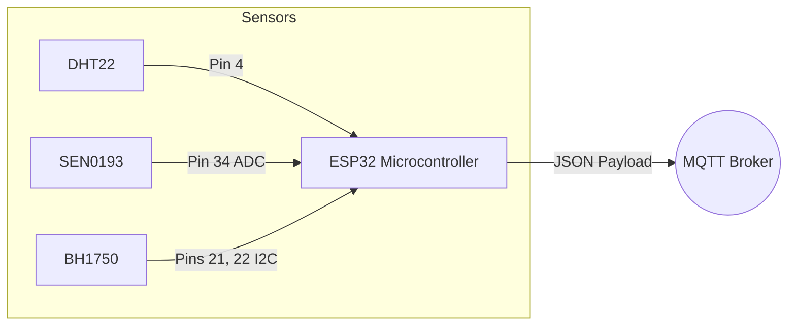

<div align="center">
  
  <h1>Gardware Gossip Garden</h1>
  <p>The central hardware module of the Gossip Garden ecosystem — an ESP32-based MicroPython application that unifies real-time telemetry from environmental sensors, secure MQTT communication, and smart power management into a seamless IoT node.</p>

  
  
  
</div>

---

## Table of Contents

1. [Ecosystem Overview](#1-ecosystem-overview)
2. [What Gardware Gossip Garden Does](#2-what-gardware-gossip-garden-does)
3. [Architecture](#3-architecture)
4. [Tech Stack](#4-tech-stack)
5. [Project Structure](#5-project-structure)
6. [Core Modules](#6-core-modules)
7. [Embedded Web Server](#7-embedded-web-server)
8. [API Reference](#8-api-reference)
9. [Hardware Assembly](#9-hardware-assembly)
10. [Flashing and Running](#10-flashing-and-running)
11. [Configuration Details](#11-configuration-details)
12. [Power Management](#12-power-management)

---

## 1. Ecosystem Overview

Gossip Garden is an intelligent plant care ecosystem composed of interconnected products tracking and managing the health of real plants:



| Product | Role |
|---|---|
| **gardwareGossipGarden** | (This repo) The physical ESP32 sensor node that collects temperature, humidity, soil moisture, and light data. |
| **Backend Server** | Consumes MQTT telemetry, evaluates plant health scores, and stores data in Supabase/Firebase. |
| **Mobile App** | User interface to monitor plant health, view sensor history, and manage Wi-Fi configuration. |

### How the products connect

1. The device starts up, reads data from its physical sensors (DHT22, SEN0193, BH1750), and connects to the configured Wi-Fi network.
2. The ESP32 securely connects to the central MQTT broker over TLS and publishes a JSON payload with the sensor readings.
3. The backend receives the MQTT message, parses the telemetry, updates the associated plant's health metrics, and stores the history.
4. The device disconnects from Wi-Fi and enters Deep Sleep to conserve battery until the next reading cycle.

---

## 2. What Gardware Gossip Garden Does

| Feature | Description |
|---|---|
| **Environmental Telemetry** | Collects precise temperature and humidity data using a DHT22 sensor. |
| **Soil Moisture Detection** | Uses an analog capacitive sensor (SEN0193) to determine water levels, avoiding corrosion issues of resistive sensors. |
| **Ambient Light Sensing** | Measures illuminance in lux using a digital I2C BH1750 sensor to ensure the plant receives optimal light. |
| **Secure MQTT Publishing** | Sends data securely to a cloud broker via TLS on port 8883, authenticating with a configured user and password. |
| **Smart Wi-Fi Provisioning** | Falls back to an Access Point (AP) mode if no known network is available, providing an embedded HTTP server for network setup. |
| **Deep Sleep & Low Power** | Runs a brief measurement and transmission cycle, then shuts down radios and sleeps to dramatically extend battery life. |
| **Hardware Wake-up** | Allows manual override and instant wake-up by holding the physical BOOT button during startup. |

---

## 3. Architecture

### System Flow



### Data Flow



---

## 4. Tech Stack

### Microcontroller

| Layer | Technology |
|---|---|
| Hardware | ESP32 Development Board |
| Firmware | MicroPython |
| Networking | `network.WLAN` |
| Deep Sleep | `machine.deepsleep`, `esp32.wake_on_ext0` |

### Key Modules and Sensors

| Component | Purpose | Protocol |
|---|---|---|
| **DHT22** | Air Temperature & Humidity | 1-Wire (Digital) |
| **SEN0193** | Capacitive Soil Moisture | ADC (Analog) |
| **GY-30 (BH1750)** | Light Intensity (Lux) | I2C |
| **umqtt.simple** | MQTT Client Implementation | TCP/TLS |
| **ujson** | Payload Formatting | JSON |

---

## 5. Project Structure

```text
gardwareGossipGarden/
│
├── main.py                   # Core execution loop, sensor reading, MQTT publishing
├── wifi_manager.py           # Wi-Fi connection logic, AP mode, HTTP setup server
├── api_contract.md           # Documentation of MQTT and HTTP interfaces
└── wifi_config.json          # (Generated) Stores Wi-Fi SSID and password
```

---

## 6. Core Modules

### main.py

The entry point of the system. It handles:
- Pin definitions and hardware initialization (I2C, ADC, DHT).
- Sensor reading functions with safe fallbacks and data clamping.
- Wi-Fi initialization by calling `wifi_manager`.
- Connecting to the MQTT broker using TLS `ssl.SSLContext`.
- Building and publishing the JSON telemetry payload.
- Entering deep sleep using `machine.deepsleep()`.

### wifi_manager.py

Handles the network lifecycle:
- Attempts to load credentials from `wifi_config.json`.
- Tries to connect to the saved network.
- If it fails (or if forced), starts an AP named `GossipGarden_Setup`.
- Runs a non-blocking TCP socket server to accept HTTP requests on port 80.
- Provides endpoints to scan for networks, check status, and save new credentials.

---

## 7. Embedded Web Server

When the device cannot connect to a known Wi-Fi network, it hosts a local HTTP server at `http://192.168.4.1`. 

### Key design decisions

| Decision | Reason |
|---|---|
| **Non-blocking Server** | Implemented using standard `socket` with a timeout, allowing the ESP32 to eventually exit AP mode if left idle, saving battery. |
| **JSON Responses** | All endpoints return pure JSON, making it easily consumable by a mobile app or frontend setup wizard. |
| **Custom Routing** | Manual parsing of HTTP headers allows for a lightweight server without external framework dependencies. |

---

## 8. API Reference

### MQTT Telemetry Publish

The device acts as a publisher. It does not subscribe to commands.

| Topic | Payload Format | Description |
|---|---|---|
| `plantas/{DEVICE_ID}/sensores` | JSON | Emitted after waking up and reading sensors. |

**Payload Example:**

```json
{
  "plant_id": "YOUR_PLANT_ID",
  "mac_address": "24:6f:28:aa:bb:cc",
  "temperature_c": 24.5,
  "humidity_pct": 45,
  "soil_moisture_pct": 60,
  "light_lux": 350.5
}
```

### HTTP Setup Endpoints (AP Mode)

| Method | Route | Description |
|---|---|---|
| `GET` | `/system/info` | Returns MAC address and firmware version. |
| `GET` | `/wifi/networks` | Scans and lists available Wi-Fi networks. |
| `GET` | `/wifi/status` | Current connection status and IP. |
| `POST` | `/wifi/connect` | Connects to a new SSID and saves credentials. |
| `POST` | `/wifi/reset` | Deletes stored credentials. |

---

## 9. Hardware Assembly

### Pin Mapping

| Sensor | ESP32 Pin | Interface |
|---|---|---|
| DHT22 Data | GPIO 4 | Digital In |
| SEN0193 Data | GPIO 34 | ADC (Analog In) |
| BH1750 SDA | GPIO 21 | I2C |
| BH1750 SCL | GPIO 22 | I2C |
| Setup Button | GPIO 0 | Digital In (Pull-up) |

---

## 10. Flashing and Running

### Prerequisites

- `esptool.py` (for flashing MicroPython)
- `ampy` or `mpremote` (for uploading files)
- MicroPython firmware for ESP32

### Steps

1. Flash the ESP32 with the MicroPython firmware using `esptool.py`.
2. Edit `main.py` to insert your `DEVICE_ID`, `PLANT_ID`, and MQTT credentials.
3. Upload `main.py` and `wifi_manager.py` to the board:
   ```bash
   mpremote fs cp main.py :
   mpremote fs cp wifi_manager.py :
   ```
4. Reset the board.

---

## 11. Configuration Details

The following variables in `main.py` must be configured before deployment:

| Variable | Usage |
|---|---|
| `DEVICE_ID` | Unique identifier for the hardware. |
| `PLANT_ID` | UUID linking the hardware to a specific plant in the backend. |
| `MQTT_BROKER` | Address of your TLS-enabled MQTT cluster. |
| `MQTT_USER` / `PASSWORD` | Authentication credentials for the broker. |
| `SOIL_RAW_DRY` / `WET` | ADC calibration thresholds for the SEN0193 sensor. |

---

## 12. Power Management

The module utilizes the ESP32's Deep Sleep functionality to minimize power consumption. 

- **Cycle:** The device wakes up, reads sensors, transmits data, and immediately goes back to sleep.
- **Duration:** Set by `SLEEP_INTERVAL_MS` (default: 30 minutes).
- **Jitter:** A small random delay is added to the sleep time to prevent network collisions if multiple devices reboot simultaneously.
- **Manual Wake:** Pressing the physical BOOT button (GPIO 0) can instantly wake the device from deep sleep (`esp32.wake_on_ext0`). Holding it forces AP setup mode.
